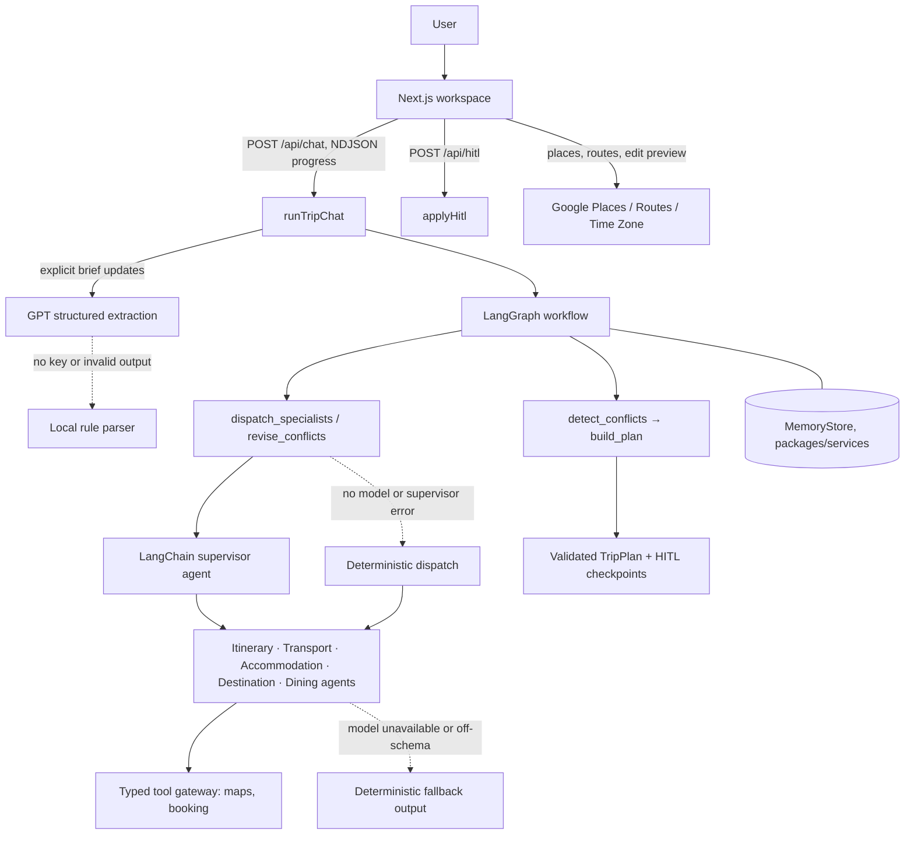

# AI Trip Planner

[](https://github.com/Lilstanie/AI_TRIP_PLANNER/actions/workflows/ci.yml)

AI Trip Planner is a single-user, multi-agent travel workspace. A user describes a trip in chat or a
preferences form; a LangGraph workflow delegates to five LangChain specialist agents and returns a
validated plan with itinerary, transport, accommodation, dining, destination guidance, budget and
human-in-the-loop (HITL) decisions.

Live demo: [elec5620-ai-trip-planner.vercel.app](https://elec5620-ai-trip-planner.vercel.app). The
hosted demo uses mock map and booking fixtures, so place and hotel names labelled “Mock …” are
expected there and are not a failed live integration. It may also lag behind the branch you are
reading.

## Current status

The LangChain agent migration is complete in this codebase:

- A deterministic LangGraph graph owns state, conflict checks, targeted revision rounds and plan
  assembly (`packages/orchestrator/src/workflow.ts`).
- Its dispatch and revision nodes delegate to a LangChain `createAgent` supervisor
  (`packages/orchestrator/src/supervisor.ts`), which selects the five specialist agents in
  `packages/agents/src/`.
- Every specialist returns a Zod-validated proposal. The legacy `Agent.run()` / `revise()` types are
  gone.
- The web workspace has local Chats/Trips history, overlay trip and preference drawers, Google Maps
  place lookup and routes, a timeline editor, HITL review and browser-local saving.

Details: [agent architecture](docs/agent-architecture.md) ·
[LangGraph orchestration](docs/langgraph-orchestration.md) ·
[UI workspace](docs/ui-improvements.md).

## Architecture



Model roles (see `packages/agents/src/models.ts` and `packages/orchestrator/src/chat.ts`):

- **GPT**: structured extraction of explicit trip-brief updates from chat messages.
- **DeepSeek**: all five specialists (`MODEL_ROUTING`), the supervisor and the natural-language reply.
- **MiniMax**: configured but not routed; see `.env.example` for why and for its account caveats.

When a provider key is missing, a call fails or output is off-schema, the affected step falls back to
validated deterministic output, so planning requests still complete.

## Prerequisites

- Node.js 22 or newer
- pnpm 9.15.0 (pinned by `packageManager`; `corepack enable` selects it)
- API keys are optional for local development: mock tools and deterministic fallbacks are enabled by
  default.

## Quick start

```bash
corepack enable
pnpm install
cp .env.example .env.local   # then fill in any keys you have
pnpm dev                     # http://localhost:3000
```

Useful environment settings (all documented in `.env.example`):

| Setting                                                             | Purpose                                                                                                                                                                             |
| ------------------------------------------------------------------- | ----------------------------------------------------------------------------------------------------------------------------------------------------------------------------------- |
| `GPT_API_KEY`, `DEEPSEEK_API_KEY`                                   | Enable model extraction, specialists, supervisor and replies.                                                                                                                       |
| `USE_MOCK_TOOLS=true` (default)                                     | In-process map and booking fixtures; no external calls.                                                                                                                             |
| `USE_MOCK_TOOLS=false`                                              | Use real map adapters chosen by `MAPS_PROVIDER` (`google` or `osm`). If it is unset, Google is used when `MAPS_API_KEY` is set, otherwise OpenStreetMap; `.env.example` sets `osm`. |
| `OSM_USER_AGENT`                                                    | Required contact string for Nominatim; replace the `contact@example.com` placeholder before real traffic or you may be rate limited.                                                |
| `MAPS_API_KEY`                                                      | Server-side Google Places, Routes and Time Zone for the workspace map and edit previews.                                                                                            |
| `NEXT_PUBLIC_GOOGLE_MAPS_API_KEY`, `NEXT_PUBLIC_GOOGLE_MAPS_MAP_ID` | Browser Google Maps JavaScript map. Without them the workspace shows a map fallback.                                                                                                |

`pnpm mock-server` starts an optional stub HTTP server on port 4000. The app does not need it:
mock tools run in process, and `MOCK_API_URL` is not read by current code. Docker Compose starts it
alongside the web app. See [docs/development.md](docs/development.md) for Docker and verification.

Checks run by CI on pull requests and pushes to `main`:

```bash
pnpm typecheck
pnpm lint
pnpm test
pnpm build
```

The web test script sets `NODE_OPTIONS` with POSIX shell syntax. On Windows, run it from WSL or Git
Bash.

## API entry points

All routes are `POST` handlers under `apps/web/app/api/`. Details are in [docs/api.md](docs/api.md).

| Path                        | Purpose                                                                                                | Contract                                                              |
| --------------------------- | ------------------------------------------------------------------------------------------------------ | --------------------------------------------------------------------- |
| `/api/chat`                 | Extract brief updates or plan a submitted brief; streams NDJSON progress and a final `{ reply, plan }` | `packages/shared/src/chat.ts`                                         |
| `/api/hitl`                 | Apply a HITL decision (approve, reject, defer, select stay) and return the updated plan                | `apps/web/app/api/hitl/route.ts`, `packages/orchestrator/src/hitl.ts` |
| `/api/places/search`        | Google Places text search for a place name, optionally within a destination                            | `apps/web/lib/google.ts`                                              |
| `/api/places/details`       | Google place details for a saved place ID                                                              | `apps/web/lib/google.ts`                                              |
| `/api/routes/from-location` | Route from a user-approved current location to a place                                                 | `apps/web/lib/google.ts`                                              |
| `/api/trip/preview-edit`    | Preview an activity move, time or place edit with route and budget checks                              | `apps/web/lib/trip-edit.ts`                                           |

## Repository layout

```text
apps/web/                 Next.js workspace UI and API routes
packages/agents/          Five specialist LangChain agents, model routing and fallbacks
packages/orchestrator/    LangGraph workflow, supervisor, chat intake, budget, conflicts, HITL
packages/shared/          Zod contracts, plan types and ports
packages/services/        memory (in-process MemoryStore), notify and auth adapters
packages/tools/           Maps and booking adapters, mock fixtures, tool gateway;
                          src/mock-server.mjs optional stub server (pnpm mock-server)
docs/                     Architecture, workflow, API, roadmap and session logs
```

## Documentation

Start with:

- [Agent architecture](docs/agent-architecture.md)
- [API entry points](docs/api.md)
- [Development environment](docs/development.md)
- [UI workspace changes and acceptance](docs/ui-improvements.md)

The full set, including module handoff notes, UML diagrams, the roadmap and AI-assisted session
logs, is in [`docs/`](docs/).

## Scope

The product target is a single-user flow: describe a trip, inspect grounded recommendations, edit the
plan, confirm HITL decisions and save it. Saving is browser-local today; durable storage is next on
the [roadmap](docs/roadmap.md). Multi-user editing, social features, payments and booking fulfilment
are out of scope.

## License

This is an ELEC5620 course project. No licence file is included, so no open-source licence has been
granted.
