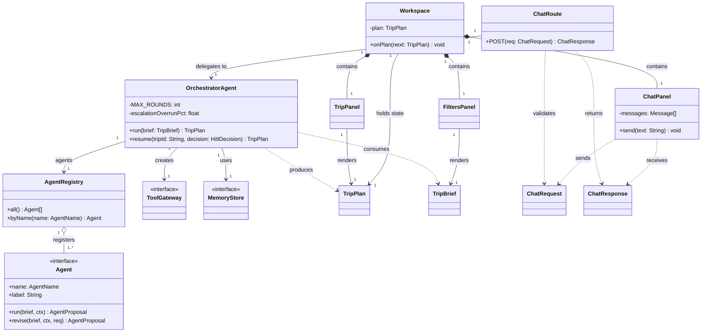
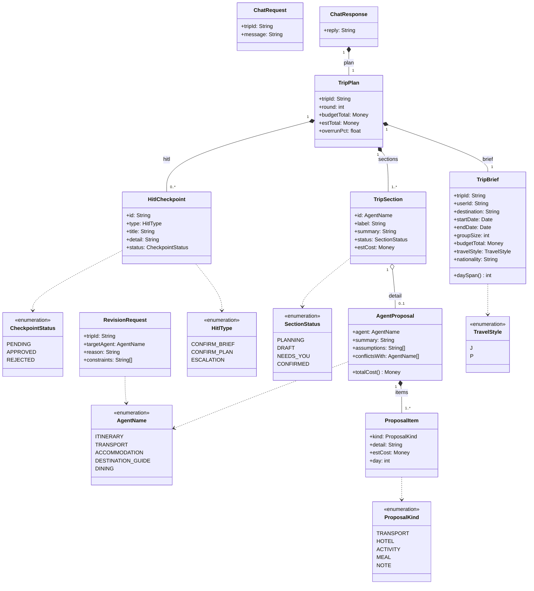
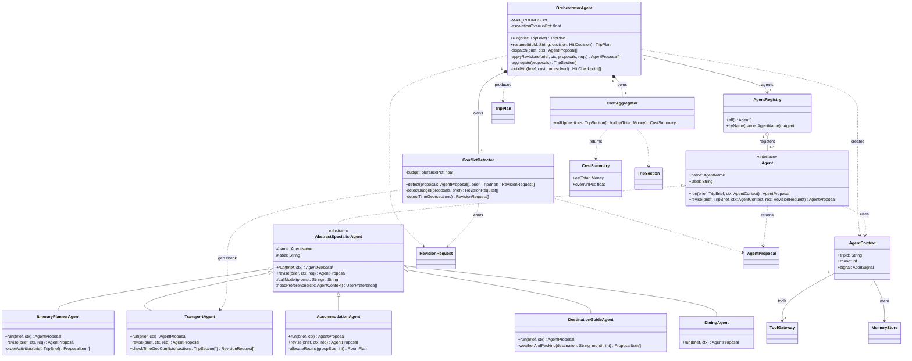

# Class model — design-time structure

ELEC5620 Lab 4 Part 2. Static structure of `AI_TRIP_PLANNER` as four UML 2.5 class
diagrams that share one namespace. Rendered reference (with the full relationship,
multiplicity, interface and rationale tables):
<https://claude.ai/code/artifact/06ae7f45-f805-47f0-b610-4c8f46854e42>

This is a **design** model — a light refinement of the current skeleton. Two classes
are introduced ahead of implementation and flagged below: `AbstractSpecialistAgent`
(shared agent behaviour) and `ConflictDetector` (conflict logic split out of the
orchestrator, per *separate control from function*).

Supporting types used in signatures but not expanded: `Money`, `Date`, `DateTime`,
`AbortSignal`, `RoomPlan`, `HitlDecision`, `TransportMode`, and the tool DTOs
`RouteQuery` / `PlaceQuery` / `Place` / `StayQuery` / `FlightQuery` / `FlightOption`.

## Notation

| Mark | Relationship | Meaning |
|---|---|---|
| solid line, hollow triangle | generalisation | subclass → superclass ("is a kind of") |
| dashed line, hollow triangle | realisation | class → interface ("implements") |
| solid line, filled diamond | composition | whole ◆ part; part cannot outlive the whole |
| solid line, hollow diamond | aggregation | whole ◇ part, shared; part has an independent lifetime |
| solid line, open arrow | association | source holds a stored reference to the target |
| dashed line, open arrow | dependency | transient use only (parameter, return, local); no stored field |

---

## Diagram 1 — Structural spine

Load-bearing classes across every layer: HTTP entry point, client shell that holds
plan state, orchestrator, agent registry, and the two interfaces the orchestrator
injects into every agent.

---

## Diagram 2 — Domain model

The value classes carried between the client, the orchestrator, and the agents.
Every field is data the agents plan against or the UI renders.

---

## Diagram 3 — Agents & orchestration

`OrchestratorAgent` owns the negotiation loop; it composes a `ConflictDetector` and
a `CostAggregator` and drives the five specialist agents through a registry. Each
agent receives its dependencies through `AgentContext` rather than importing them.

---

## Diagram 4 — Ports, adapters & infrastructure

The hexagonal boundary. Ports live in `packages/shared`; concrete adapters — mock
and real — implement them. `ToolGatewayImpl` is a factory that wires one adapter per
port based on `USE_MOCK_TOOLS`.

---

## Key associations & multiplicity

Read *source → target*.

| Source | Target | Type | Mult. | Meaning |
|---|---|---|---|---|
| `Workspace` | `FiltersPanel` / `ChatPanel` / `TripPanel` | composition | 1 → 1 | shell owns one of each child view |
| `Workspace` / `TripPanel` | `TripPlan` | association | 1 → 1 | holds / renders the current plan |
| `ChatRoute` | `OrchestratorAgent` | association | 1 → 1 | HTTP handler delegates every request |
| `ChatResponse` | `TripPlan` | composition | 1 → 1 | response carries a full plan |
| `OrchestratorAgent` | `ConflictDetector` / `CostAggregator` | composition | 1 → 1 | private owned helpers |
| `OrchestratorAgent` | `AgentRegistry` / `ToolGateway` / `MemoryStore` | association | 1 → 1 | looks up agents; injects tools + memory |
| `AgentRegistry` | `Agent` | aggregation | 1 → 1..* | references shared singletons; no lifecycle ownership |
| `AgentContext` | `ToolGateway` / `MemoryStore` | association | 1 → 1 | injected — the agent's only route out |
| `TripPlan` | `TripBrief` | composition | 1 → 1 | embeds an immutable snapshot |
| `TripPlan` | `TripSection` | composition | 1 → 1..* | one section per specialist agent |
| `TripPlan` | `HitlCheckpoint` | composition | 1 → 0..* | pending human decisions on this plan |
| `AgentProposal` | `ProposalItem` | composition | 1 → 1..* | a proposal is its list of line items |
| `TripSection` | `AgentProposal` | aggregation | 1 → 0..1 | holds the proposal it was built from, for drill-down |
| `ToolGateway` | `MapsPort` / `BookingPort` | aggregation | 1 → 1 | exposes one port of each kind |
| `PreferenceMemoryService` | `ChatTurn` / `UserPreference` | composition | 1 → 0..* | owns the short- / long-term records |
| `AuthService` | `User` | dependency | → 0..1 | `currentUser()` may return none |

## Interfaces & realisation

| Interface | Realised by | Note |
|---|---|---|
| `Agent` | `AbstractSpecialistAgent` (abstract) → `ItineraryPlannerAgent`, `TransportAgent`, `AccommodationAgent`, `DestinationGuideAgent`, `DiningAgent` | base realises the interface + `revise()` + shared helpers; concretes override `run()` |
| `ToolGateway` | `ToolGatewayImpl` | also a factory (`create()`) reading `USE_MOCK_TOOLS` |
| `MapsPort` | `MockMapsAdapter`, `RealMapsAdapter` | owner B |
| `BookingPort` | `MockBookingAdapter`, `RealBookingAdapter` | owner C; real payment out of scope |
| `MemoryStore` | `PreferenceMemoryService` | owner E; in-memory now, SQLite/Redis later, same signature |
| `NotificationService` | `StubNotificationService` | owner E |
| `AuthService` | `StubAuthService` | owner E |

## Design rationale

- **`Agent` is an interface, not a base class** — the orchestrator iterates `Agent[]` and calls `run()` without knowing the concrete type or whether it uses an LLM.
- **`AbstractSpecialistAgent` (generalisation)** — all five specialists load preferences and call the model the same way; the base carries that, subclasses implement only `run()`. Design-time; the skeleton has five independent stubs.
- **`AgentRegistry → Agent` is aggregation** — agents are module-level singletons; the registry references them but does not own their lifecycle.
- **`OrchestratorAgent → ConflictDetector / CostAggregator` is composition** — private collaborators with no independent identity. Splitting them out follows *separate control from function*.
- **Dependencies injected via `AgentContext`** — agents never import concrete services, so a unit test passes a fake `ToolGateway` and mock↔real is a one-line switch in the factory.
- **Ports in `packages/shared` (hexagonal)** — the core never names a concrete adapter, so external APIs can change without touching agent or orchestrator code.
- **`TripPlan` composes a `TripBrief` snapshot** — a plan answers one specific brief; embedding a copy means a later brief edit cannot silently invalidate an existing plan.
- **`ConflictDetector` depends on `TransportAgent`** — "are these two stops reachable in one day?" needs routing data owned by `TransportAgent`; control asks, function answers.
