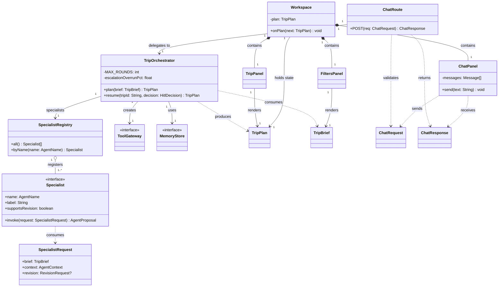
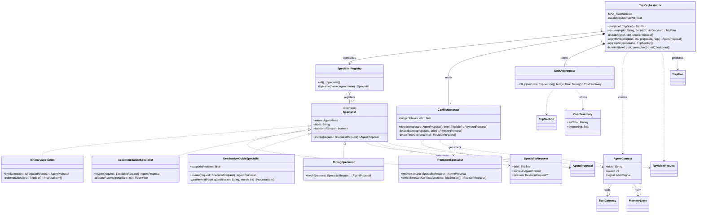
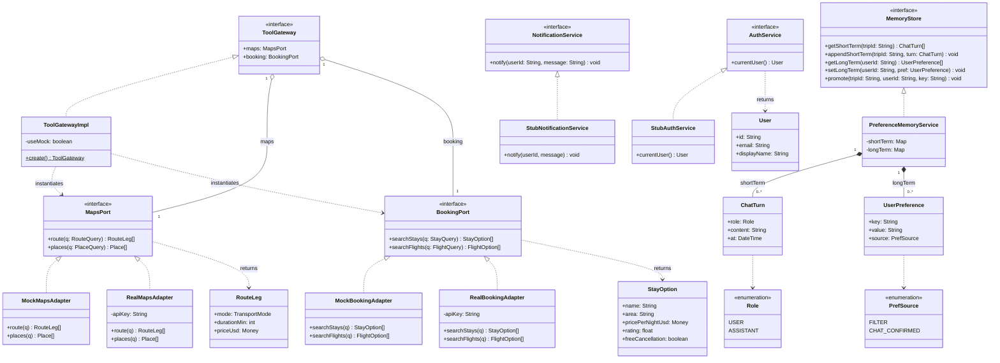

# Class model — design-time structure

ELEC5620 Lab 4 Part 2. Static structure of `AI_TRIP_PLANNER` as five UML 2.5 class
diagrams that share one namespace. Rendered reference (with the full relationship,
multiplicity, interface and rationale tables):
<https://claude.ai/code/artifact/06ae7f45-f805-47f0-b610-4c8f46854e42>

This is a **design** model — a light refinement of the current skeleton. One class
is introduced ahead of implementation and flagged below: `ConflictDetector`
(conflict logic split out of the
orchestrator, per *separate control from function*).

Supporting types used in signatures but not expanded: `Money`, `Date`, `DateTime`,
`AbortSignal`, `RoomPlan`, `HitlDecision`, `TransportMode`, and the tool DTOs
`RouteQuery` / `PlaceQuery` / `Place` / `StayQuery` / `FlightQuery` / `FlightOption`.

## Notation

| Mark | Relationship | Meaning |
|---|---|---|
| solid line, hollow triangle | generalisation | subclass → superclass ("is a kind of") |
| dashed line, hollow triangle | realisation | class → interface ("implements") |
| solid line, filled diamond | composition | whole ◆ part; part cannot outlive the whole |
| solid line, hollow diamond | aggregation | whole ◇ part, shared; part has an independent lifetime |
| solid line, open arrow | association | source holds a stored reference to the target |
| dashed line, open arrow | dependency | transient use only (parameter, return, local); no stored field |

---

## Diagram 1 — Structural spine

Load-bearing classes across every layer: HTTP entry point, client shell that holds
plan state, orchestrator, specialist registry, and the two interfaces the orchestrator
injects into every specialist.

---

## Diagram 2 — Domain model

The value classes carried between the client, the orchestrator, and the specialists.
Every field is data the specialists plan against or the UI renders.

```mermaid
classDiagram
  direction TB
  class TripBrief {
    +tripId: String
    +userId: String
    +destination: String
    +startDate: Date
    +endDate: Date
    +groupSize: int
    +budgetTotal: Money
    +nationality: String
    +daySpan() int
  }
  class ProposalItem {
    +kind: ProposalKind
    +detail: String
    +estCost: Money
    +day: int
  }
  class AgentProposal {
    +agent: AgentName
    +summary: String
    +assumptions: String[]
    +conflictsWith: AgentName[]
    +totalCost() Money
  }
  class RevisionRequest {
    +tripId: String
    +targetAgent: AgentName
    +reason: String
    +constraints: String[]
  }
  class TripSection {
    +id: AgentName
    +label: String
    +summary: String
    +status: SectionStatus
    +estCost: Money
  }
  class HitlCheckpoint {
    +id: String
    +type: HitlType
    +title: String
    +detail: String
    +status: CheckpointStatus
  }
  class TripPlan {
    +tripId: String
    +round: int
    +budgetTotal: Money
    +estTotal: Money
    +overrunPct: float
  }
  class ChatRequest {
    +tripId: String
    +message: String
  }
  class ChatResponse {
    +reply: String
  }
  class AgentName {
    <<enumeration>>
    ITINERARY
    TRANSPORT
    ACCOMMODATION
    DESTINATION_GUIDE
    DINING
  }
  class SectionStatus {
    <<enumeration>>
    PLANNING
    DRAFT
    NEEDS_YOU
    CONFIRMED
  }
  class HitlType {
    <<enumeration>>
    CONFIRM_BRIEF
    CONFIRM_PLAN
    ESCALATION
  }
  class CheckpointStatus {
    <<enumeration>>
    PENDING
    APPROVED
    REJECTED
  }
  class ProposalKind {
    <<enumeration>>
    TRANSPORT
    HOTEL
    ACTIVITY
    MEAL
    NOTE
  }

  TripPlan "1" *-- "1" TripBrief : brief
  TripPlan "1" *-- "1..*" TripSection : sections
  TripPlan "1" *-- "0..*" HitlCheckpoint : hitl
  AgentProposal "1" *-- "1..*" ProposalItem : items
  TripSection "1" o-- "0..1" AgentProposal : detail
  ChatResponse "1" *-- "1" TripPlan : plan
  AgentProposal ..> AgentName
  RevisionRequest ..> AgentName
  TripSection ..> SectionStatus
  HitlCheckpoint ..> HitlType
  HitlCheckpoint ..> CheckpointStatus
  ProposalItem ..> ProposalKind
```

---

## Diagram 3 — Specialists & orchestration

`TripOrchestrator` owns the negotiation loop; it composes a `ConflictDetector` and
a `CostAggregator` and drives the five specialists through a registry. Each
specialist receives its dependencies through `AgentContext` rather than importing them.

---

## Diagram 4 — Ports, adapters & infrastructure

The hexagonal boundary. Ports live in `packages/shared`; concrete adapters — mock
and real — implement them. `ToolGatewayImpl` is a factory that wires one adapter per
port based on `USE_MOCK_TOOLS`.

---

## Diagram 5 — use cases traced onto the specialist & orchestration model

Diagram 3 with the ten `«use case»` from the use case model folded in: the actor
`Traveler` is associated with every use case; `«include»` / `«extend»` hold between
use cases; and a `«trace»` dependency runs from each use case to the class that
realises it.

```mermaid
classDiagram
  direction TB

  class Traveler {
    <<actor>>
  }
  namespace UseCases {
    class UC1["Set Preferences (Filter)"] {
      <<use case>>
    }
    class UC2["Submit Requirement (Chat)"] {
      <<use case>>
    }
    class UC3["Generate Itinerary"] {
      <<use case>>
    }
    class UC7["Confirm Key Itinerary (HITL)"] {
      <<use case>>
    }
    class UC6["Manage Budget"] {
      <<use case>>
    }
    class UC4["Arrange Transportation"] {
      <<use case>>
    }
    class UC5["Arrange Accommodation (Individual / Group)"] {
      <<use case>>
    }
    class UC8["View Weather-based Clothing Recommendation"] {
      <<use case>>
    }
    class UC9["View Food / Cuisine Recommendation"] {
      <<use case>>
    }
    class UC10["View Itinerary Output"] {
      <<use case>>
    }
  }

  Traveler --> UC1
  Traveler --> UC2
  Traveler --> UC3
  Traveler --> UC7
  Traveler --> UC6
  Traveler --> UC4
  Traveler --> UC5
  Traveler --> UC8
  Traveler --> UC9
  Traveler --> UC10

  UC3 ..> UC1 : «include»
  UC3 ..> UC2 : «include»
  UC7 ..> UC3 : «extend»
  UC7 ..> UC6 : «extend»

  class Specialist {
    <<interface>>
    +name: AgentName
    +label: String
    +supportsRevision: boolean
    +invoke(request: SpecialistRequest) AgentProposal
  }
  class SpecialistRequest {
    +brief: TripBrief
    +context: AgentContext
    +revision: RevisionRequest?
  }
  class ItinerarySpecialist {
    +invoke(request: SpecialistRequest) AgentProposal
    -orderActivities(brief: TripBrief) ProposalItem[]
  }
  class TransportSpecialist {
    +invoke(request: SpecialistRequest) AgentProposal
    +checkTimeGeoConflicts(sections: TripSection[]) RevisionRequest[]
  }
  class AccommodationSpecialist {
    +invoke(request: SpecialistRequest) AgentProposal
    -allocateRooms(groupSize: int) RoomPlan
  }
  class DestinationGuideSpecialist {
    +supportsRevision: false
    +invoke(request: SpecialistRequest) AgentProposal
    -weatherAndPacking(destination: String, month: int) ProposalItem[]
  }
  class DiningSpecialist {
    +invoke(request: SpecialistRequest) AgentProposal
  }
  class AgentContext {
    +tripId: String
    +round: int
    +signal: AbortSignal
  }
  class SpecialistRegistry {
    +all() Specialist[]
    +byName(name: AgentName) Specialist
  }
  class TripOrchestrator {
    -MAX_ROUNDS: int
    -escalationOverrunPct: float
    +plan(brief: TripBrief) TripPlan
    +resume(tripId: String, decision: HitlDecision) TripPlan
    -dispatch(brief, ctx) AgentProposal[]
    -applyRevisions(brief, ctx, proposals, reqs) AgentProposal[]
    -aggregate(proposals) TripSection[]
    -buildHitl(brief, cost, unresolved) HitlCheckpoint[]
  }
  class ConflictDetector {
    -budgetTolerancePct: float
    +detect(proposals: AgentProposal[], brief: TripBrief) RevisionRequest[]
    -detectBudget(proposals, brief) RevisionRequest[]
    -detectTimeGeo(sections) RevisionRequest[]
  }
  class CostAggregator {
    +rollUp(sections: TripSection[], budgetTotal: Money) CostSummary
  }
  class CostSummary {
    +estTotal: Money
    +overrunPct: float
  }
  class TripPlan {
    +tripId: String
    +round: int
    +estTotal: Money
  }

  Specialist <|.. ItinerarySpecialist
  Specialist <|.. TransportSpecialist
  Specialist <|.. AccommodationSpecialist
  Specialist <|.. DestinationGuideSpecialist
  Specialist <|.. DiningSpecialist

  TripOrchestrator "1" --> "1" SpecialistRegistry : specialists
  SpecialistRegistry "1" o-- "1..*" Specialist : registers
  TripOrchestrator "1" *-- "1" ConflictDetector : owns
  TripOrchestrator "1" *-- "1" CostAggregator : owns
  TripOrchestrator ..> AgentContext : creates
  TripOrchestrator ..> RevisionRequest
  TripOrchestrator ..> TripPlan : produces

  ConflictDetector ..> AgentProposal
  ConflictDetector ..> RevisionRequest : emits
  ConflictDetector ..> TransportSpecialist : geo check
  CostAggregator ..> TripSection
  CostAggregator ..> CostSummary : returns

  Specialist ..> AgentProposal : returns
  Specialist ..> SpecialistRequest : consumes
  Specialist ..> AgentContext : uses
  AgentContext "1" --> "1" ToolGateway : tools
  AgentContext "1" --> "1" MemoryStore : mem

  UC1 ..> MemoryStore : «trace»
  UC2 ..> TripOrchestrator : «trace»
  UC3 ..> TripOrchestrator : «trace»
  UC7 ..> TripOrchestrator : «trace»
  UC6 ..> CostAggregator : «trace»
  UC4 ..> TransportSpecialist : «trace»
  UC5 ..> AccommodationSpecialist : «trace»
  UC8 ..> DestinationGuideSpecialist : «trace»
  UC9 ..> DiningSpecialist : «trace»
  UC10 ..> TripPlan : «trace»
```

| Use case | «trace» → class | Owner |
|---|---|---|
| Set Preferences (Filter) | `MemoryStore` (writes long-term preferences) | E |
| Submit Requirement (Chat) | `TripOrchestrator` (parses into a brief) | E |
| Generate Itinerary | `TripOrchestrator` | A |
| Confirm Key Itinerary (HITL) | `TripOrchestrator.buildHitl` / `resume` | A |
| Manage Budget | `CostAggregator.rollUp` | C |
| Arrange Transportation | `TransportSpecialist` | B |
| Arrange Accommodation | `AccommodationSpecialist` | C |
| View Weather-based Clothing Recommendation | `DestinationGuideSpecialist` (LLM weather sub-function) | D |
| View Food / Cuisine Recommendation | `DiningSpecialist` | D |
| View Itinerary Output | `TripPlan` (rendered by the web `TripPanel`) | E |

---

## Key associations & multiplicity

Read *source → target*.

| Source | Target | Type | Mult. | Meaning |
|---|---|---|---|---|
| `Workspace` | `FiltersPanel` / `ChatPanel` / `TripPanel` | composition | 1 → 1 | shell owns one of each child view |
| `Workspace` / `TripPanel` | `TripPlan` | association | 1 → 1 | holds / renders the current plan |
| `ChatRoute` | `TripOrchestrator` | association | 1 → 1 | HTTP handler delegates every request |
| `ChatResponse` | `TripPlan` | composition | 1 → 1 | response carries a full plan |
| `TripOrchestrator` | `ConflictDetector` / `CostAggregator` | composition | 1 → 1 | private owned helpers |
| `TripOrchestrator` | `SpecialistRegistry` / `ToolGateway` / `MemoryStore` | association | 1 → 1 | looks up specialists; injects tools + memory |
| `SpecialistRegistry` | `Specialist` | aggregation | 1 → 1..* | references shared singletons; no lifecycle ownership |
| `AgentContext` | `ToolGateway` / `MemoryStore` | association | 1 → 1 | injected — the specialist's only route out |
| `TripPlan` | `TripBrief` | composition | 1 → 1 | embeds an immutable snapshot |
| `TripPlan` | `TripSection` | composition | 1 → 1..* | one section per specialist |
| `TripPlan` | `HitlCheckpoint` | composition | 1 → 0..* | pending human decisions on this plan |
| `AgentProposal` | `ProposalItem` | composition | 1 → 1..* | a proposal is its list of line items |
| `TripSection` | `AgentProposal` | aggregation | 1 → 0..1 | holds the proposal it was built from, for drill-down |
| `ToolGateway` | `MapsPort` / `BookingPort` | aggregation | 1 → 1 | exposes one port of each kind |
| `PreferenceMemoryService` | `ChatTurn` / `UserPreference` | composition | 1 → 0..* | owns the short- / long-term records |
| `AuthService` | `User` | dependency | → 0..1 | `currentUser()` may return none |

## Interfaces & realisation

| Interface | Realised by | Note |
|---|---|---|
| `Specialist` | `ItinerarySpecialist`, `TransportSpecialist`, `AccommodationSpecialist`, `DestinationGuideSpecialist`, `DiningSpecialist` | each concrete implements `invoke(SpecialistRequest)`; revision support is explicit |
| `ToolGateway` | `ToolGatewayImpl` | also a factory (`create()`) reading `USE_MOCK_TOOLS` |
| `MapsPort` | `MockMapsAdapter`, `RealMapsAdapter` | owner B |
| `BookingPort` | `MockBookingAdapter`, `RealBookingAdapter` | owner C; real payment out of scope |
| `MemoryStore` | `PreferenceMemoryService` | owner E; in-memory now, SQLite/Redis later, same signature |
| `NotificationService` | `StubNotificationService` | owner E |
| `AuthService` | `StubAuthService` | owner E |

## Design rationale

- **`Specialist` is the framework-neutral interface** — the orchestrator iterates `Specialist[]` and calls `invoke(SpecialistRequest)` without knowing the concrete type or whether it uses an LLM.
- **`SpecialistRegistry → Specialist` is aggregation** — specialists are module-level singletons; the registry references them but does not own their lifecycle.
- **`TripOrchestrator → ConflictDetector / CostAggregator` is composition** — private collaborators with no independent identity. Splitting them out follows *separate control from function*.
- **Dependencies injected via `AgentContext`** — specialists never import concrete services, so a unit test passes a fake `ToolGateway` and mock↔real is a one-line switch in the factory.
- **Ports in `packages/shared` (hexagonal)** — the core never names a concrete adapter, so external APIs can change without touching specialist or orchestrator code.
- **`TripPlan` composes a `TripBrief` snapshot** — a plan answers one specific brief; embedding a copy means a later brief edit cannot silently invalidate an existing plan.
- **`ConflictDetector` depends on `TransportSpecialist`** — "are these two stops reachable in one day?" needs routing data owned by `TransportSpecialist`; control asks, function answers.
