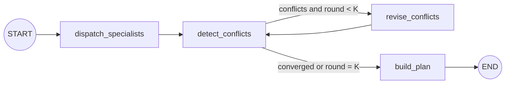

# LangGraph orchestration

The orchestrator is a deterministic LangGraph workflow. LangGraph controls the state transitions;
the five existing specialist modules remain ordinary typed `Agent` implementations. This keeps
budget policy and human checkpoints predictable while still allowing individual nodes to call an
LLM later.



## State

The graph carries `brief`, `round`, `proposals`, `conflicts`, and the final `plan`. Public input and
output still use the existing `@trip/shared` Zod contracts, so the web route and specialist agents
do not need API changes. Shared Zod v3 values are validated at the graph boundaries; the graph's
internal `StateSchema` uses its local Zod v4 dependency.

## Execution rules

- `dispatch_specialists` runs all registered agents with `Promise.all`.
- `detect_conflicts` currently implements budget conflict detection. Time and geography checks are
  still pending.
- `revise_conflicts` runs only targeted agents that implement `revise`, also with `Promise.all`.
- A conditional edge repeats detection/revision up to `maxRounds` (default `3`).
- `build_plan` preserves the existing cost roll-up and HITL/escalation behavior.
- Agents, tools, memory, and the round limit are injectable through `OrchestratorOptions` for tests.

This is intentionally a workflow rather than an unconstrained supervisor agent: the control path,
budget red lines, and stopping condition should not depend on a model improvising the next step.
LLM-backed brief extraction and specialist reasoning can be added inside bounded nodes without
changing this graph shape.

## Verification

```bash
pnpm --filter @trip/orchestrator test
pnpm typecheck
pnpm build
```

The workflow tests verify the named graph topology, stable `TripPlan` output, concurrent targeted
revisions, round-limit escalation, and invalid configuration handling.
